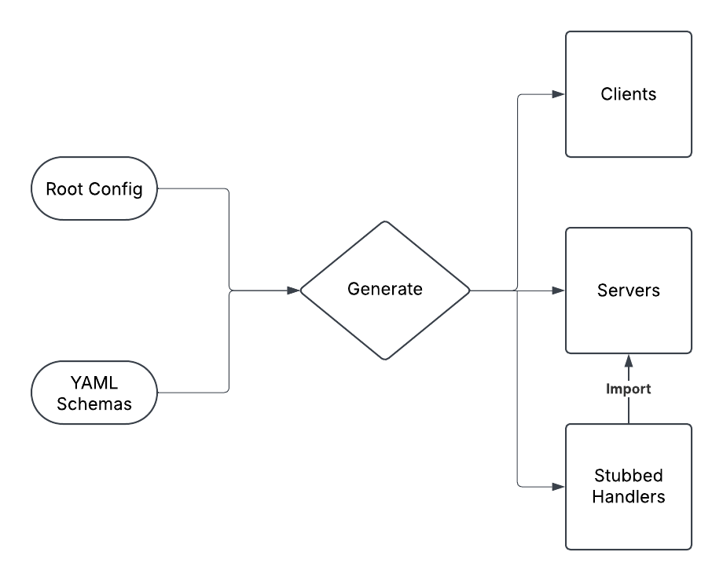

# AutoMCP

<p align="center">
  
</p>

AutoMCP is a code generator for the Model Context Protocol (MCP) that automatically creates server and client code based on YAML service definitions.

## Features

- Generates MCP-compatible server code
- Generates client libraries for easy service consumption
- Creates handler stubs for implementing tool functionality
- Organizes code by service in dedicated directories

## Getting Started

### Prerequisites

- Node.js 18 or higher
- npm or yarn

### Installation

1. Clone this repository
2. Install dependencies:
   ```
   npm install
   ```

### Usage

#### Defining a Service

Create a YAML file in the `services/[service-name]/` directory with the following structure:

```yaml
service:
  name: ServiceName
  version: 1.0.0
  description: Description of your service

tools:
  - name: toolName
    description: Description of what the tool does
    parameters:
      - name: paramName
        type: string
        description: Description of the parameter
    returns:
      type: string
      description: Description of what the tool returns
```

#### Generating Code

Run the generator script:

```
./bin/automcp.sh generate
```

This will:

1. Create server code in `generated/[service-name]/[service-name]_server.ts`
2. Create client code in `generated/[service-name]/[service-name]_client.ts`
3. Create handler stubs in `src/custom/[service-name]/[tool-name]Handlers.ts`

#### Implementing Handlers

Edit the generated handler files in `src/custom/[service-name]/` to implement your tool functionality.

#### Using the Generated Clients

```typescript
import { ServiceNameClient } from "./generated/service-name/service_name_client.js";

async function main() {
  const client = new ServiceNameClient();

  try {
    await client.connect();

    // Call a tool
    const result = await client.toolName({ paramName: "value" });
    console.log(result);
  } finally {
    await client.disconnect();
  }
}

main().catch(console.error);
```

## Example

See the `examples/client_example.ts` file for a complete example of using the generated clients.

## Testing

Use the test script to verify the functionality of your services:

```
./bin/test-service.sh [service-name]
```

## Temporary Directory Structure (will be improved for packaging)

```
.
├── bin/                    # Scripts
├── examples/               # Example usage
├── generated/              # Generated code
│   ├── service-name/       # Service-specific generated code
│   │   ├── service_name_server.ts
│   │   └── service_name_client.ts
├── services/               # Service definitions
│   └── service-name/       # Service-specific YAML files
├── src/                    # Source code
│   ├── custom/             # Custom handler implementations
│   │   └── service-name/   # Service-specific handlers
│   │       └── toolHandlers.ts
│   └── generator.ts        # Code generator
└── templates/              # Code templates
    ├── client.ts.ejs       # Client template
    └── server.ts.ejs       # Server template
```

## Future Plans

- Support for multiple programming languages
- Integration with existing MCP solutions
- Implement with prompts and resource mechanisms
- Enhanced composition mechanisms for complex tool chains

## License

MIT
